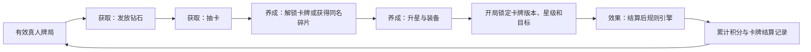
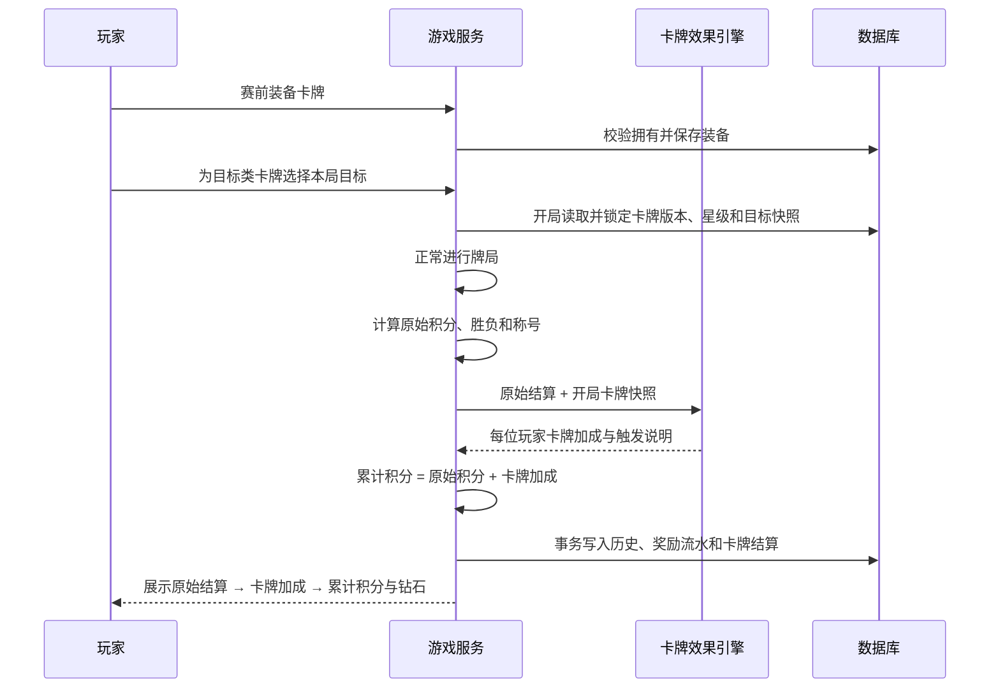

# 英雄卡抽取与养成系统需求逻辑底稿

> 2026-07-29 名称与边界确认：本文描述的是未来的“英雄卡系统”，包含抽卡、养成、装备和结算后技能。它与钻石商城销售、牌局内一次性使用的“对局道具”不是同一个系统；对局道具以 `shop-and-consumable-items-requirement-analysis.md` 为准。英雄卡仍暂缓实现，钻石奖励口径以 `diamond-system-requirement-analysis.md` 为准，本文件第 6 节的旧数值不再生效。

## I. 核心要点快照

### 一句话定义

玩家在有效真人牌局结束后获得钻石，用钻石抽取并装备卡牌；卡牌只在牌局原始结算完成后追加个人积分，不改变本局胜负、称号、钻石奖励或任何出牌规则。

### 推荐结论

- 每名玩家初期只装备 1 张卡，开局时锁定快照，牌局中不能更换。
- 沿用现有“全员为已登录真人”的有效牌局口径；机器人局无钻石、无卡牌积分。
- 先完成现有结算并冻结胜负与称号，再单独计算卡牌加成。
- 排行榜累计积分使用“原始积分 + 卡牌加成”，胜场仍按原始积分判断。
- 卡牌效果使用后端“结算后积分调整引擎”，以白名单事实、条件和效果组成声明式规则，不允许卡牌之间连锁触发。
- 卡牌目录先随代码版本发布；资产、抽卡、装备和结算记录存入数据库。

### 三大领域模块

| 模块 | 负责范围 | 核心输出 |
|---|---|---|
| 卡牌获取 | 钻石奖励、钱包流水、卡池、抽卡概率、保底、抽卡记录 | 新卡解锁或同名卡牌碎片 |
| 卡牌效果 | 结算事实、目标选择、条件判断、百分比/固定值调整、计算轨迹 | `cardScoreDelta` |
| 卡牌养成 | 图鉴、收藏筛选、碎片、升星、装备、星级效果预览 | 开局使用的卡牌版本与星级 |

### P0 必须实现

1. 获取：钻石钱包、牌局奖励、卡池、概率、保底和幂等抽卡。
2. 效果：独立规则引擎、目标选择、三段式结算和计算轨迹。
3. 养成：卡牌图鉴、同名碎片、升星、装备与开局星级锁定。
4. 数据：抽卡、升星、装备、牌局奖励和卡牌结算全链路可追溯。

### 重大约束

- 卡牌加成不得反向参与牌局胜负、称号、MVP、钻石奖励和其他卡牌的触发判断。
- 本方案采用“个人额外加分”的非零和模式；卡牌生效后全场累计积分之和可以大于 0，这是明确的产品口径。
- 指定玩家类卡牌只复制目标的原始积分，不扣除目标积分；目标在开局前锁定并公开展示，避免结算时临时选择最高分玩家。
- 团队效果只能增加自己或原始结算中的最终队友积分，不能减少对手积分；同一叠加组对同一玩家只取最高值。
- 规则配置只能组合后端白名单能力，禁止数据库脚本、表达式求值和动态执行代码。
- 升星只改变卡牌配置中明确声明的效果参数；不能在通用层面对全部卡牌统一乘倍数。
- 开局锁定卡牌版本、星级和目标，牌局中抽到同卡或完成升星只对下一局生效。
- 浏览器只展示结果，不能决定抽卡结果、修改钻石或执行卡牌效果。
- 数据库失败不能阻塞牌局结束，但奖励必须可重试且同一牌局只能发放一次。
- 初期不开放钻石充值、卡牌交易、赠送和分解，避免经济与合规复杂度失控。

## II. 需求场景锚点

### 用户故事

| 角色 | 用户故事 | 成功标准 |
|---|---|---|
| 玩家 | 作为玩家，我希望完成真人牌局获得钻石，以持续收集卡牌 | 结算页显示本局获得数量，钱包流水可追溯 |
| 玩家 | 作为玩家，我希望用钻石抽卡，以扩充可装备卡牌 | 扣费与发卡在同一事务内完成，刷新页面不会重复扣费 |
| 玩家 | 作为玩家，我希望查看完整图鉴与个人收藏 | 可区分未获得、已获得、当前星级、碎片进度和装备状态 |
| 玩家 | 作为玩家，我希望消耗同名碎片升星 | 升星后能预览效果变化，重复请求不会重复消耗碎片 |
| 玩家 | 作为玩家，我希望赛前装备卡牌，以获得额外积分效果 | 开局后装备锁定，结算能说明触发条件和加成 |
| 玩家 | 作为玩家，我希望为指定目标类卡牌选择一名对局玩家 | 准备前完成选择，开局后所有人可看到锁定目标 |
| 对局参与者 | 作为参赛者，我希望卡牌不篡改本局胜负 | 胜负、称号、钻石只依据原始结算 |
| 管理员 | 作为管理员，我希望能停用异常卡牌 | 停用后不能新装备，已开始牌局仍按开局快照结算 |

### 核心用例

| 用例 | 正常路径 | 异常闭环 |
|---|---|---|
| 获得钻石 | 有效牌局结束 → 按原始胜负计算 → 写入钱包流水 | 重复结算命中幂等键，不重复发放 |
| 抽卡 | 校验余额 → 锁钱包 → 扣费 → 随机抽取 → 解锁新卡/重复卡转同名碎片 → 提交 | 余额不足直接拒绝；事务失败不扣钻石 |
| 查看收藏 | 读取卡牌目录与个人卡牌数据 → 合并图鉴 | 未获得卡牌只展示公开信息，不泄露隐藏内容 |
| 升星 | 校验星级与碎片 → 锁定卡牌行 → 扣碎片 → 星级增加 | 碎片不足、满星或重复请求均不得重复消耗 |
| 装备 | 校验拥有且卡牌启用 → 保存装备 | 已准备或牌局中只影响下一局 |
| 选择目标 | 装备需要目标的卡牌 → 在当前房间选择其他真人玩家 | 目标离开后自动清空选择并取消准备 |
| 开局锁定 | 读取每位玩家当前装备 → 保存卡牌版本快照 | 数据库暂不可用时该局按未装备处理并明确提示 |
| 卡牌结算 | 原始结算冻结 → 独立计算卡牌加成 → 生成累计积分 | 单张卡计算失败时该玩家加成为 0，不影响牌局结束 |

## III. 业务模型定义

### 核心实体

| 实体 | 关键属性 | 说明 |
|---|---|---|
| 钻石钱包 | `account_id`、余额、保底计数 | 余额只能由服务端事务更新 |
| 钻石流水 | 数量、原因、关联牌局/抽卡、幂等键 | 钱包变更的审计来源 |
| 卡牌目录 | 卡牌编号、版本、稀有度、目标模式、逐星规则、升星成本、状态 | 获取、效果和养成共享的唯一静态定义 |
| 玩家卡牌 | 账号、卡牌编号、星级、同名碎片、首次获得时间 | 一张卡一行，不保存多个重复实例 |
| 装备方案 | 账号、已装备卡牌、更新时间 | P0 只有一个槽位 |
| 抽卡记录 | 抽卡编号、卡池版本、成本、结果、保底前后状态 | 用于复核随机结果 |
| 升星记录 | 账号、卡牌、升星前后等级、碎片消耗、幂等键 | 用于审计和处理重复请求 |
| 开局卡牌快照 | 牌局、账号、卡牌编号、版本、星级、目标账号、引擎版本 | 防止牌局中换卡、升星或改配置影响当前局 |
| 卡牌结算记录 | 原始积分、事实快照、加分来源与接收者、累计积分、计算轨迹 | 历史页、重放计算与争议复核依据 |

### 状态迁移

| 对象 | 原状态 | 触发 | 新状态 |
|---|---|---|---|
| 卡牌 | 未拥有 | 抽中 | 已拥有 |
| 重复卡 | 已拥有且未满星 | 再次抽中 | 转为该卡同名碎片 |
| 重复卡 | 已满星 | 再次抽中 | 保持满星并按稀有度返还钻石 |
| 星级 | 1～4 星 | 碎片充足且升星成功 | 增加 1 星并扣除配置数量的碎片 |
| 星级 | 5 星 | 再次请求升星 | 保持 5 星且不扣资源 |
| 装备 | 未装备 | 玩家装备 | 已装备 |
| 装备 | 已装备 A | 玩家装备 B | 已装备 B |
| 目标选择 | 未选择 | 在房间选择有效玩家 | 已选择 |
| 目标选择 | 已选择 | 目标退出房间 | 清空目标并取消准备 |
| 装备快照 | 未锁定 | 房主成功开局 | 已锁定至本局结束 |
| 牌局结算 | 进行中 | 最后一轮结束 | 原始结算冻结 |
| 卡牌结算 | 未执行 | 原始结算冻结 | 已计算或安全降级为 0 |
| 奖励发放 | 待发放 | 数据库事务成功 | 已发放 |

## IV. 流程架构

## V. 核心逻辑规则

### 1. 有效牌局

- 全部参赛者必须是已登录真人账号。
- 含机器人、游客或测试玩家的牌局不发钻石，也不计卡牌积分。
- 同一账号不能在同一局占据多个席位。
- 每个账号每天最多 10 局获得钻石，按 `Asia/Shanghai` 自然日计算；超出后仍正常记录牌局积分。

### 2. 结算顺序

1. 按现有规则计算原始牌分、原始个人积分、胜负和称号。
2. 冻结原始结算，后续逻辑不得修改。
3. 使用开局快照逐人计算卡牌加成。
4. `累计积分 = 原始个人积分 + 卡牌加成`。
5. 胜场、胜率、称号、钻石奖励继续使用原始个人积分。
6. 总积分、积分走势默认使用累计积分，并同时保留原始积分和卡牌加成明细。
7. 卡牌系统在新赛季起点统一启用，避免同一赛季混用无卡牌和有卡牌的积分口径。

### 3. 卡牌效果边界

- P0 每人只能装备 1 张卡；不设置全局固定加分上限，每张卡必须独立声明百分比、单局封顶和最低值。
- 卡牌只能读取冻结后的原始结算事实，不读取其他卡牌的计算结果。
- 卡牌不能改变手牌、主花色、叫庄、出牌、牌分、阵营、保底归属或胜负。
- 卡牌效果只能输出指向持有者或最终队友的积分调整记录，不能直接修改任何玩家的原始结算对象。
- 指定目标类卡牌默认只读取目标的原始积分并为持有者额外加分，不从目标处扣分。
- 所有小数统一保留两位，按现有积分显示规则去除无意义的末尾零。
- 卡牌停用只阻止后续装备；已开始牌局按开局快照中的版本执行。

### 4. 结算后积分调整引擎

#### 4.1 输入事实

引擎接收只读的 `SettlementFacts`，首期开放以下白名单事实：

| 范围 | 事实示例 |
|---|---|
| 自己 | 原始积分、原始胜负、阵营、角色、牌分、获胜轮数、被拖红五/方五数量、拖对手五的加权值、甩牌失败次数、称号 |
| 目标玩家 | 原始积分、原始胜负、阵营、角色 |
| 最后一轮 | 底牌赢家、底牌归属阵营、底牌牌分 |
| 全局 | 叫庄方式、主花色、目标牌分、闲家牌分、原始牌局胜方 |

所有事实均来自原始结算快照。引擎执行期间不可修改事实，也不可读取累计积分。

#### 4.2 规则结构

每张卡由以下字段组成：

- `targetMode`：`self`、`selected_other_player` 或 `none`。
- `conditions`：由 `eq`、`gt`、`gte`、`lt`、`lte`、`in` 等白名单比较符组成。
- `recipientMode`：`self`、`selected_player_if_teammate`、`all_teammates` 或组合接收者。
- `effects`：`add_fixed`、`add_percent`、`reduce_loss_percent`、`copy_target_percent` 等白名单效果。
- `rateBps`：百分比使用整数基点保存，例如 `2000` 表示 `20%`。
- `perGameMin` / `perGameMax`：单张卡的最低与最高调整值。
- `stackGroup`：同组效果作用于同一接收者时只保留最高调整值。
- `stackPolicy`：首期固定为 `independent`，所有效果只基于原始事实独立计算。
- `version`：任何规则或数值变化都生成新版本，旧牌局继续使用开局快照版本。

禁止让运营配置任意公式字符串。新增事实、比较符或效果类型时，应在后端增加实现和单元测试后再开放给卡牌配置。

#### 4.3 执行步骤

1. 验证卡牌版本、目标玩家和规则结构。
2. 从冻结的原始结算生成事实快照。
3. 逐条判断条件，未满足时输出 `cardScoreDelta = 0`。
4. 满足条件后根据原始事实计算未经封顶的调整值。
5. 应用卡牌自己的最低值、最高值和负数策略。
6. 汇总该卡全部效果后统一四舍五入到两位小数。
7. 为自己或符合条件的最终队友生成不可变调整记录：卡牌持有者、接收者、目标、命中条件、来源值、原始调整、封顶结果和最终调整。
8. 同一叠加组取最高值，不同组可以叠加；每名玩家每局从队友处获得的总加成最多 2 分。
9. 计算 `累计积分 = 原始积分 + 自己卡牌加成 + 队友给予的卡牌加成`。

因为每张卡始终只读取原始事实，未来即使增加多个装备槽位，卡牌之间也不会因执行顺序不同而产生不同结果。

#### 4.4 示例规则口径

| 效果 | 触发与公式 | 边界 |
|---|---|---|
| 获胜额外增加 X% | `原始积分 > 0` 时，`delta = 原始积分 × X%` | X 必须为正数，并受该卡单局封顶限制 |
| 失败少扣 X% | `原始积分 < 0` 时，`delta = abs(原始积分) × X%` | X 最大 100%，累计积分不能高于 0 |
| 复制指定玩家 X% | 开局前指定其他玩家，`delta = max(目标原始积分, 0) × X%` | 不扣目标积分；目标负分时加成为 0 |
| 被拖红五少扣 1 分 | 自己被拖红五数量大于 0 时，`delta = 1` | 每局只触发一次，不按红五数量叠加 |
| 赢得底牌额外加 1 分 | 自己是最后一轮赢家时，`delta = 1` | 不修改原始保底归属和团队底牌分 |

稀有度不直接决定数值强弱；通过触发难度、适用场景和单局封顶区分，长期期望收益保持接近，避免高稀有卡形成不可追赶优势。

### 5. 首批 15 种卡牌技能

以下数值为 1～5 星的建议初版。调整数值时必须发布新的卡牌版本，已经开始或已经结束的牌局继续保留原版本。

| # | 技能 | 接收者 | 触发条件 | 1～5 星效果 |
|---:|---|---|---|---|
| 1 | 凯旋号角 | 自己 | 原始积分大于 0 | 额外获得原始积分的 `5/7.5/10/12.5/15%`，逐星封顶 `0.5/0.75/1/1.5/2` 分 |
| 2 | 不屈护盾 | 自己 | 原始积分小于 0 | 减免负分的 `10/15/20/25/30%`，逐星封顶 `0.5/0.75/1/1.5/2` 分，不能减免至正分 |
| 3 | 红五护符 | 自己 | 自己至少被拖 1 张红桃 5 | 每局一次补回 `0.5/0.75/1/1.5/2` 分，不能超过本局红五造成的原始扣分 |
| 4 | 方五挂坠 | 自己 | 自己至少被拖 1 张方块 5 | 每局一次补回 `0.25/0.4/0.55/0.75/1` 分，不能超过本局方五造成的原始扣分 |
| 5 | 守底之王 | 自己 | 自己赢得最后一轮底牌 | 额外获得 `0.5/0.75/1/1.25/1.5` 分 |
| 6 | 猎五者 | 自己 | 自己拖到对手红五或方五 | 按拖五加权值的 `10/15/20/25/30%` 加分，逐星封顶 `0.5/0.75/1/1.25/1.5` 分 |
| 7 | 稳健牌手 | 自己 | 本局无甩牌失败且至少赢得 1 轮 | 额外获得 `0.2/0.3/0.4/0.5/0.6` 分 |
| 8 | 庄家威仪 | 自己 | 自己是庄家且原始积分大于 0 | 额外获得 `0.4/0.6/0.8/1/1.2` 分 |
| 9 | 忠犬勋章 | 自己和庄家 | 自己最终成为狗腿且庄队原始获胜 | 自己获得 `0.4/0.6/0.8/1/1.2` 分，庄家获得 `0.2/0.3/0.4/0.5/0.6` 分 |
| 10 | 闲家战旗 | 自己和其他闲家 | 自己是闲家且闲家原始获胜 | 自己获得 `0.3/0.4/0.5/0.6/0.7` 分，其他闲家各获得 `0.1/0.15/0.2/0.25/0.3` 分 |
| 11 | 借势而上 | 自己 | 开局指定玩家的原始积分大于 0 | 获得目标原始积分的 `5/7.5/10/12.5/15%`，逐星封顶 `0.5/0.75/1/1.5/2` 分，不扣目标积分 |
| 12 | 同心契约 | 自己和指定玩家 | 开局指定玩家在原始结算中与自己同队 | 双方各获得 `0.2/0.3/0.4/0.5/0.6` 分；不同队时不触发 |
| 13 | 冠军馈赠 | 自己和所有队友 | 自己获得原始结算的 MVP 称号 | 自己获得 `0.3/0.4/0.5/0.7/0.9` 分，每名队友获得 `0.1/0.15/0.2/0.25/0.3` 分 |
| 14 | 辅弼之光 | 自己和所有队友 | 自己获得原始结算的“辅”称号 | 自己获得 `0.25/0.4/0.55/0.7/0.85` 分，每名队友获得 `0.1/0.15/0.2/0.25/0.3` 分 |
| 15 | 逆境同盟 | 自己和指定队友 | 自己原始积分小于 0，且开局指定玩家最终与自己同队 | 双方各减免自身负分的 `5/7.5/10/12.5/15%`，逐星每人封顶 `0.5/0.75/1/1.25/1.5` 分 |

- “最终队友”和所有称号均由原始结算确定，卡牌加分不能改变。
- “拖五加权值”沿用现有积分权重：每张红桃 5 计 2，每张方块 5 计 1。
- 首期不设计纯辅助卡。每张卡必须让持卡人自己直接获得积分收益或负分减免，队友收益只能作为附带效果。
- 同一卡牌技能由多人提供给同一接收者时，只保留星级更高、实际加分更大的那一份。
- 不同技能可以叠加，但每名玩家每局从队友卡牌获得的总加分最多 2 分；自己的卡牌加分不占该额度。
- 团队卡的加分记录必须同时标明卡牌持有者和实际接收者，便于历史复核。

### 5.1 首期三国主题卡草案

以下角色卡均满足“持卡人自己先受益”的规则；涉及队友时只提供少量附带加成。

| 角色卡 | 技能名 | 接收者 | 触发条件 | 1～5 星效果 |
|---|---|---|---|---|
| 诸葛亮 | 空城定局 | 自己 | 原始积分小于 0 | 减免负分的 `12/16/20/25/30%`，封顶 `0.5/0.75/1/1.5/2` 分，不能减至正分 |
| 曹操 | 魏武追胜 | 自己 | 原始积分大于 0 | 额外获得原始积分的 `5/7.5/10/12.5/15%`，封顶 `0.5/0.75/1/1.5/2` 分 |
| 刘备 | 仁德归心 | 自己和队友 | 原始积分大于 0 | 自己获得 `0.3/0.45/0.6/0.8/1` 分；队友各获得 `0.05/0.1/0.15/0.2/0.25` 分 |
| 关羽 | 武圣斩五 | 自己 | 自己拖到对手红五或方五 | 按拖五加权值的 `12/16/20/25/30%` 加分，封顶 `0.5/0.75/1/1.25/1.5` 分 |
| 赵云 | 龙胆护主 | 自己 | 自己至少被拖 1 张红五或方五 | 每局一次补回 `0.5/0.75/1/1.25/1.5` 分，不能超过本局拖五原始损失 |
| 吕布 | 无双破阵 | 自己 | 获得原始 MVP 且原始积分大于 0 | 额外获得 `0.6/0.8/1/1.3/1.6` 分 |
| 司马懿 | 隐忍反计 | 自己 | 原始积分小于 0，且至少赢得 1 轮 | 减免负分的 `8/12/16/20/25%`，封顶 `0.4/0.6/0.9/1.2/1.5` 分 |
| 周瑜 | 赤壁借风 | 自己 | 赢得最后一轮底牌 | 额外获得 `0.5/0.75/1/1.25/1.5` 分；若原始积分大于 0，再加 `0.2/0.3/0.4/0.5/0.6` 分 |
| 孙策 | 小霸王 | 自己和闲家队友 | 自己是闲家且闲家原始获胜 | 自己获得 `0.4/0.55/0.7/0.9/1.1` 分；其他闲家各获得 `0.1/0.15/0.2/0.25/0.3` 分 |
| 貂蝉 | 离间连环 | 自己 | 开局指定玩家的原始积分大于 0 | 获得目标原始积分的 `5/7.5/10/12.5/15%`，封顶 `0.5/0.75/1/1.5/2` 分，不扣目标积分 |
| 董卓 | 太师暴敛 | 自己 | 原始积分大于 0，且赢得底牌或拖到对手五 | 额外获得 `0.5/0.7/0.9/1.2/1.5` 分 |
| SP 前田敦子 | 绝对 Center | 自己和队友 | 获得原始 MVP | 自己获得 `0.4/0.55/0.7/0.9/1.1` 分；队友各获得 `0.1/0.15/0.2/0.25/0.3` 分 |
| SP 渡边麻友 | 王道偶像 | 自己和队友 | 本局无甩牌失败且至少赢得 1 轮 | 自己获得 `0.25/0.35/0.45/0.6/0.75` 分；若原始积分大于 0，队友各获得 `0.05/0.1/0.15/0.2/0.25` 分 |

### 6. 钻石奖励

| 原始牌局结果 | 钻石 |
|---|---:|
| 原始个人积分大于 0 | 10 |
| 原始个人积分等于 0 | 8 |
| 原始个人积分小于 0 | 6 |
| 无效牌局 | 0 |

- 卡牌加成不影响钻石数量。
- 奖励幂等键使用 `game_reward:{game_id}:{account_id}`。
- 不按积分绝对值发钻石，避免强卡牌、极端比分和对刷扩大经济差距。

### 7. 抽卡规则

- 单抽 10 钻石，十连抽 100 钻石。
- 基础概率：普通 70%、稀有 25%、史诗 5%。
- 十连至少包含 1 张稀有或史诗；连续 30 抽未获得史诗时，第 30 抽必出史诗。
- 首次抽到卡牌时以 1 星解锁；再次抽到同卡时转为该卡的同名碎片。
- 已满星卡牌再次抽中时返还钻石：普通 3、稀有 5、史诗 10。
- 随机结果由服务端安全随机数生成，客户端只提交抽取次数和唯一请求编号。
- 每次抽卡记录卡池版本、概率版本、保底前后计数、卡牌结果和碎片/钻石转换结果。

### 8. 卡牌收集与升星

- 卡牌首次获得时为 1 星，最高 5 星。
- 重复卡只转为该卡专属碎片，不进入可装备列表形成多个实例。
- 每个稀有度配置独立的“重复卡碎片数量”和“逐星碎片成本表”，所有计算均使用抽卡时锁定的卡池版本。
- 升星只消耗同名碎片，不额外消耗钻石，避免获取与养成同时争抢同一种资源。
- 每次只能提升 1 星；服务端锁定玩家卡牌行后再次校验碎片与当前星级。
- 升星请求必须携带唯一 `requestId`；相同请求重复发送时返回首次结果。
- 每张卡在目录中逐星声明完整效果参数，例如 1～5 星分别配置不同的 `rateBps`、固定值或单局封顶。
- 不使用“当前星级 × 通用倍率”，避免百分比卡、固定值卡和条件卡出现不可控增长。
- 图鉴展示全部公开卡牌；未获得卡牌显示基础说明，已获得卡牌额外显示当前星级、碎片进度、当前效果和下一星效果。
- 装备中的卡牌升星后，个人卡牌页立即显示新星级，但已经开始的牌局继续使用开局锁定星级。

## VI. 交互与异常协议

### 页面与入口

1. 首页增加“卡牌”入口，角标显示钻石余额。
2. 卡牌中心包含卡池与概率、单抽/十连、完整图鉴、个人收藏、升星和当前装备。
3. 卡牌详情同时展示当前星级效果、下一星变化、碎片需求和获取来源。
4. 准备房间展示每位玩家装备卡牌的名称与星级；未装备显示“无”。
5. 装备指定目标类卡牌时，玩家必须在准备前选择本房间另一名真人玩家；卡牌和目标均向全房公开。
6. 开局后只展示锁定结果，换卡、升星或修改目标仅对下一局生效。
7. 结算页分三步展示：原始积分、卡牌触发与计算过程、计入累计的最终积分和钻石奖励。
8. 历史详情展示卡牌编号、版本、星级、目标、来源数值、封顶过程、加成和原始/累计积分。

### 异常处理

- 余额不足：不进入抽卡事务，提示还差多少钻石。
- 重复请求：返回第一次的抽卡或奖励结果，不再次扣费或发奖。
- 并发抽卡：锁定钱包行，后到请求基于最新余额重新校验。
- 并发升星：锁定玩家卡牌行，后到请求基于最新星级与碎片重新校验。
- 碎片不足或卡牌满星：不修改任何数据，并返回当前星级与碎片进度。
- 装备卡牌被停用：当前装备自动视为无效，提示重新选择。
- 指定目标无效或已退出：清空目标、取消该玩家准备状态，并要求重新选择。
- 开局读库失败：牌局可继续，但全局明确显示“本局未启用卡牌与钻石奖励”。
- 结算写库失败：牌局正常结束，服务端进入幂等重试；成功前页面显示“奖励处理中”。
- 跨时区：时间统一存 UTC；钻石奖励已不设每日获奖局数上限。

## VII. 研发与测试参考

### 推荐技术路径

| 方案 | 优点 | 缺点 | 结论 |
|---|---|---|---|
| 白名单声明式积分调整引擎 | 可版本控制、易审查、可重放、效果测试稳定 | 新增效果类型需要写代码 | P0 推荐 |
| 任意表达式或脚本规则引擎 | 表面上能快速设计新卡 | 难审计、难封顶、存在安全与历史重放风险 | 不采用 |
| 数据库动态组合白名单规则 | 无需发布即可调整已有规则组合 | 需要管理后台、配置校验和回滚 | 引擎稳定后再做 |

### 后端模块

- `card-catalog.js`：共享卡牌定义、稀有度、卡池、逐星参数和版本校验。
- `card-acquisition.js`：钻石奖励、钱包流水、抽卡概率、保底与重复卡转换。
- `card-rule-engine.js`：事实生成、规则结构校验和纯函数效果计算，只接收冻结的原始结算与卡牌快照。
- `card-progression.js`：图鉴合并、碎片、升星、装备与养成事务。
- `card-system.js`：三个领域的统一编排入口，不承载具体规则。
- `server.js`：只负责鉴权、接口编排、开局快照和三段式结算接入。

### 数据库建议

- `cdp_player_wallets`：账号余额与史诗保底计数。
- `cdp_diamond_ledger`：每次钻石增减及唯一幂等键。
- `cdp_player_cards`：玩家拥有的唯一卡牌、当前星级与同名碎片。
- `cdp_card_loadouts`：当前装备卡牌。
- `cdp_card_draws`：抽卡请求、卡池版本、成本和结果。
- `cdp_card_upgrades`：升星前后等级、碎片消耗与唯一请求编号。
- `cdp_game_card_results`：开局卡牌/星级/目标快照、引擎版本、事实快照、原始积分、卡牌加成、累计积分和计算轨迹。
- `cdp_game_players` 新增 `base_game_score` 与 `card_score_delta`；现有 `game_score` 保存计入排行榜的累计积分，历史数据回填为 `base_game_score = game_score`、`card_score_delta = 0`。

牌局历史、钻石奖励与卡牌结算应在同一数据库事务内写入。只有新牌局插入成功时才发放奖励；失败整体回滚，重试时由唯一幂等键兜底。

### API 建议

| 方法 | 路径 | 用途 |
|---|---|---|
| `GET` | `/api/cards/catalog` | 获取卡牌与当前卡池 |
| `GET` | `/api/cards/me` | 获取余额、卡牌库、装备和保底进度 |
| `POST` | `/api/cards/equip` | 装备或卸下卡牌 |
| `POST` | `/api/cards/:cardId/star-up` | 消耗同名碎片提升一星，必须传唯一 `requestId` |
| `POST` | `/api/rooms/:roomId/card-target` | 为当前房间的目标类卡牌选择目标玩家 |
| `POST` | `/api/cards/draw` | 单抽或十连，必须传唯一 `requestId` |
| `GET` | `/api/cards/draws` | 查询个人抽卡记录 |

### 重点测试

- 原始积分与胜负先冻结，卡牌加成不能翻转胜负或改变称号。
- 获胜加成、败方减免、复制目标、红五保护和底牌加成的公式、封顶与小数精度。
- 团队技能只能命中最终队友；同叠加组取最高值，队友来源总加成封顶 2 分。
- 给队友增加积分后，原始牌局胜负、胜率、称号和钻石奖励保持不变。
- 目标退出、目标负分、目标是自己、开局后改目标等分支全部被拒绝或安全降级。
- 相同原始结算、卡牌版本和目标快照必须得到完全相同的计算轨迹与结果。
- 未知事实、比较符或效果类型不能进入有效卡牌目录。
- 同一牌局重复结算不会重复发钻石。
- 同一抽卡请求重复发送不会重复扣费。
- 两个并发抽卡请求不能把余额扣成负数。
- 首次解锁、重复卡转碎片、满星重复卡退款和卡池版本快照正确。
- 升星碎片消耗、逐星参数、满星拦截、并发升星和请求幂等正确。
- 牌局中升星或换卡不会改变已经锁定的卡牌版本与星级。
- 数据库失败后重试的结果与首次成功完全一致。
- 历史牌局回填后总积分和胜率口径不变。

### 实施顺序

1. 先定义三个领域共享的卡牌目录结构、版本规则和数据库模型。
2. 实现获取模块：钱包流水、牌局奖励、抽卡、概率、保底与重复卡转换。
3. 实现养成模块：图鉴、碎片、升星、装备和开局星级快照。
4. 实现效果模块：事实模型、规则引擎、目标选择和三段式结算。
5. 接入卡牌中心、准备房间、结算页、历史详情与排行榜口径。
6. 最后增加管理能力、卡池轮换和首批卡牌平衡参数。
