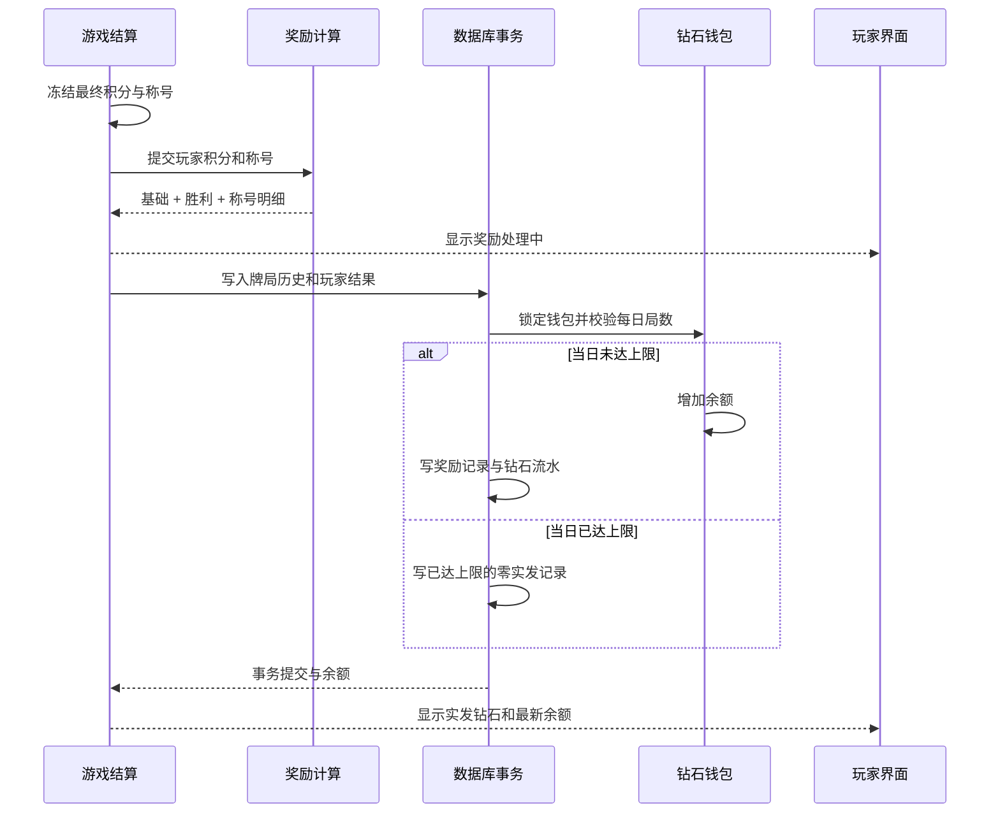

# 钻石系统需求逻辑底稿

## I. 核心要点快照

### 一句话定义

有效真人牌局结束后，每名玩家获得基础钻石；最终积分获胜和正向表现称号提供额外钻石，奖励与牌局历史在同一事务中幂等入账。

### 核心逻辑结论

- 首期只开放钻石赚取、余额、流水和结算明细，不开放抽卡、充值、交易、赠送或消费。
- “获胜”沿用排行榜口径：玩家本局最终积分 `game_score > 0`，不使用单纯的目标牌分胜负。
- 每局基础 5 钻石，获胜额外 3 钻石，正向称号按固定表加成，称号部分每局最多 5 钻石。
- 负面或可能被刻意刷取的称号不奖励钻石。
- 每个账号按北京时间自然日最多 10 局获得钻石；到达上限后牌局和统计照常记录。

### P0 必须实现

1. 账号级钻石钱包和不可变流水。
2. 牌局奖励公式、每日局数上限和规则版本快照。
3. 与牌局历史同事务写入、按牌局和账号幂等。
4. 结算页展示基础、胜利、称号、实发数量与发放状态。
5. 登录玩家可看到当前钻石余额。

### 重大风险与约束

- 含机器人、游客、未登录玩家或重复账号席位的牌局不发钻石。
- 浏览器只展示奖励，不能决定数量或修改余额。
- 称号奖励只能读取已冻结的原始结算，不反向改变积分、胜负或称号。
- 规则变更必须产生新版本，已结束牌局不能按新数值重算。
- 数据库失败不能阻塞牌局结束；奖励进入重试，成功前显示“处理中”。

## II. 需求场景锚点

### 用户故事

| 角色 | 用户故事 | 成功标准 |
|---|---|---|
| 玩家 | 作为完成真人牌局的玩家，我希望获得基础钻石 | 无论输赢都有基础收益 |
| 获胜玩家 | 作为最终积分获胜者，我希望获得额外钻石 | 结算明确展示胜利加成 |
| 表现优秀玩家 | 作为获得正向称号的玩家，我希望表现转化为额外奖励 | 展示每个奖励称号及数量 |
| 玩家 | 作为玩家，我希望看到准确余额 | 余额与服务端钱包、流水一致 |
| 运营维护者 | 作为维护者，我希望调整未来奖励而不改写历史 | 每笔奖励保存规则版本和明细 |

### 核心用例

| 用例 | 正常路径 | 异常闭环 |
|---|---|---|
| 真人局发奖 | 冻结结算 → 计算奖励 → 写历史 → 更新钱包 → 写奖励与流水 → 提交 | 任一步失败整体回滚并重试 |
| 重复结算 | 再次提交同一牌局 | 命中奖励主键和流水幂等键，不重复入账 |
| 达到日上限 | 当日已奖励 10 局 → 完成新牌局 | 保存“已达上限”的奖励结果，实发 0 |
| 无效牌局 | 含机器人或未登录席位 | 结算显示不符合奖励条件，不创建钱包流水 |
| 查询余额 | 登录账号请求钱包 | 返回余额、当日进度和最近奖励 |

## III. 业务模型定义

### 实体定义

| 实体 | 关键属性 | 说明 |
|---|---|---|
| 钻石钱包 | 账号、余额、累计获得、更新时间 | 服务端锁行更新，余额不得为负 |
| 牌局钻石奖励 | 牌局、账号、奖励日期、规则版本、计算值、实发值、状态、明细 | 同一牌局同一账号只有一条 |
| 钻石流水 | 账号、变动量、变动后余额、原因、牌局、幂等键 | 不可变审计记录 |
| 奖励规则 | 版本、基础值、胜利值、称号表、称号封顶、日上限 | 首期随代码发布 |

### 状态迁移

| 对象 | 原状态 | 触发 | 新状态 |
|---|---|---|---|
| 奖励 | 未计算 | 有效牌局结算冻结 | 处理中 |
| 奖励 | 处理中 | 当日未满 10 局且事务成功 | 已发放 |
| 奖励 | 处理中 | 当日已满 10 局且事务成功 | 已达上限 |
| 奖励 | 处理中 | 数据库事务失败 | 保持处理中并重试 |
| 钱包 | 当前余额 | 奖励已发放 | 余额增加并写流水 |

## IV. 流程架构图

## V. 核心逻辑规则矩阵

### 奖励公式

`实发钻石 = 基础奖励 + 胜利奖励 + min(称号奖励合计, 5)`

| 奖励项 | 条件 | 钻石 |
|---|---|---:|
| 基础奖励 | 有效真人牌局 | 5 |
| 胜利奖励 | 最终积分 `game_score > 0` | 3 |
| MVP | 获得 `mvp` | 3 |
| 辅 | 获得 `support` | 2 |
| 精 | 获得 `precision` | 1 |
| 神 | 获得 `god` | 2 |
| 天之上 | 获得 `heaven` | 额外 1 |
| 尽 | 获得 `exhausted` | 1 |
| 擎 | 获得 `pillar` | 额外 1 |

`couch`、`pit`、`stiff`、`stiffest`、`thunder`、`god-pit` 不提供称号钻石。相同称号去重后再计算。`神 + 天之上` 和 `尽 + 擎` 的高级称号采用增量奖励。

### 有效牌局

- 所有席位均为已登录真人账号。
- 同一账号在同一局只能占一个席位。
- 牌局自然完成并生成唯一 `game_id`。
- 每账号按 `Asia/Shanghai` 自然日最多 10 局实发奖励。
- 第 11 局起仍保存牌局、积分和称号，只将钻石实发记为 0。

### 幂等与一致性

- 奖励唯一键：`(game_id, account_id)`。
- 流水幂等键：`game_reward:{game_id}:{account_id}`。
- 牌局历史、玩家结果、称号、奖励、钱包和流水在同一数据库事务提交。
- 钱包更新前锁定账号钱包行，避免并发结算导致日上限或余额错误。

## VI. 交互与异常协议

### 信息展示

- 顶部账号区域展示 `💎 当前余额`。
- 结算页每名玩家展示钻石实发值。
- 当前玩家可看到自己的拆分：基础、胜利、奖励称号、称号封顶和发放状态。
- 状态文案限定为：处理中、已发放、今日奖励局数已满、不符合奖励条件、发放失败。
- 含机器人牌局在开局和结算处明确说明不发钻石。

### 异常闭环

- 数据库暂不可用：牌局正常结束，奖励显示处理中并由服务端重试。
- 重复请求或服务重启重放：返回既有奖励，不重复增加余额。
- 跨北京时间零点重试：奖励日期按牌局完成时间计算，不按重试时间漂移。
- 规则升级：新牌局使用新版本；历史奖励使用保存的旧版本与明细展示。

## VII. 研发与测试参考

### API

| 方法 | 路径 | 用途 |
|---|---|---|
| `GET` | `/api/diamonds/me` | 返回当前账号余额、当日奖励进度和最近奖励 |

### 关键测试

- 输方无称号固定获得 5，胜方无称号获得 8。
- MVP 胜方获得 11。
- 多个正向称号累加后称号部分不超过 5。
- 负面称号不会产生奖励。
- `神 + 天之上` 和 `尽 + 擎` 按增量值叠加。
- 含机器人或未登录席位的牌局不发奖。
- 同一牌局重复保存不重复加余额或写流水。
- 同账号并发结算不会突破每日 10 局上限。
- 第 11 局保存实发 0，但牌局历史和称号仍存在。
- 数据库回滚后钱包、奖励和流水均无半成品。
- 结算页从处理中切换到最终实发状态。
